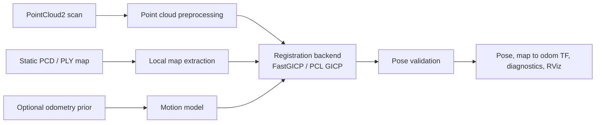

# Modular 3D Localizer

`modular_3d_localizer` is a ROS 2 Humble framework for full SE(3) localization
of an incoming 3D point cloud against a static PCD or PLY map.

## Architecture



The ROS 2 interfaces around registration are independent of the selected
backend. Adding an algorithm therefore changes the backend implementation and
factory registration, not map I/O, point-cloud conversion, TF integration, or
visualization.

## Demo

[](https://youtu.be/Drk_Oqwzhg4)

KISS-ICP frontend and FastGICP map-localization demo. Click the thumbnail to watch on YouTube.

## Input and TF contract

Required inputs are a static map, a `sensor_msgs/msg/PointCloud2` scan topic,
an initial `map -> base_frame` pose on `/initialpose`, and a resolvable
`base_frame -> lidar_frame` transform.

`base_frame -> lidar_frame` should normally be published by the user's URDF,
sensor driver, or `robot_state_publisher`. The launch file can publish one
parameterized static transform only when no external TF source exists.

An optional `nav_msgs/msg/Odometry` topic supplies a motion prior. The
localizer does not require a particular frontend: wheel odometry, visual-
inertial odometry, LiDAR-inertial odometry, and LiDAR odometry are all valid
as long as they use the configured `odom_frame -> base_frame` convention.

With `tf_output_mode:=map_to_odom`, the resulting tree is:

```text
map -> odom       published by this package
odom -> base      published by the optional odometry frontend
base -> lidar     published by URDF, sensor driver, or static TF
```

## Profiles and launch overrides

All ROS parameters have conservative defaults in `config/defaults.yaml`.
`config/generic_fast_gicp.yaml` is the baseline FastGICP tracking profile.
The selected `params_file` is layered over defaults; a non-empty launch
argument overrides the profile.

Minimal FastGICP bringup:

```bash
ros2 launch modular_3d_localizer localizer.launch.py \
  map_path:=/data/map.pcd \
  point_cloud_topic:=/lidar/points \
  base_frame:=base_link \
  lidar_frame:=lidar
```

If the external TF tree already contains `base_link -> lidar`, do not enable
`publish_base_lidar_tf`.

## Required FastGICP backend

FastGICP is the required registration dependency and the default backend for
this package. PCL GICP and coarse-to-fine PCL GICP remain available as
comparison or extension backends.

```bash
colcon build --packages-select modular_3d_localizer --symlink-install \
  --cmake-args \
  -DFAST_GICP_PREFIX=/path/to/fast_gicp/install
export LD_LIBRARY_PATH=/path/to/fast_gicp/install/lib:$LD_LIBRARY_PATH
```

The repository CI builds FastGICP from its official source repository before
building this package; it does not require CUDA.

Then use the profile and override only environment-specific values:

```bash
ros2 launch modular_3d_localizer localizer.launch.py \
  params_file:=/path/to/generic_fast_gicp.yaml \
  map_path:=/data/map.pcd \
  point_cloud_topic:=/lidar/points \
  base_frame:=base_link \
  lidar_frame:=lidar \
  motion_model:=odometry \
  odometry_topic:=/odometry \
  tf_output_mode:=map_to_odom
```

For a sensor without a TF publisher, add its calibrated extrinsic explicitly:

```bash
publish_base_lidar_tf:=true \
base_lidar_x:=0.0 base_lidar_y:=0.0 base_lidar_z:=0.0 \
base_lidar_roll:=0.0 base_lidar_pitch:=0.0 base_lidar_yaw:=0.0
```

## Extending the framework

The package separates ROS 2 map/scan/TF plumbing from registration. The
following contracts are the intended extension points.

### Use a different odometry frontend without changing this package

KISS-ICP is only a tested example, not a package dependency. Any frontend can
provide the motion prior when it publishes:

1. a `sensor_msgs/msg/PointCloud2` scan topic whose `header.frame_id` matches
   `lidar_frame`; and
2. a `nav_msgs/msg/Odometry` topic with `header.frame_id == odom_frame` and
   `child_frame_id == base_frame`.

It should also publish the matching `odom_frame -> base_frame` TF when
`tf_output_mode:=map_to_odom` is selected. Configure the localizer as follows:

```bash
ros2 launch modular_3d_localizer localizer.launch.py \
  point_cloud_topic:=/frontend/points \
  motion_model:=odometry \
  odometry_topic:=/frontend/odometry \
  odom_frame:=odom \
  base_frame:=base_link \
  lidar_frame:=lidar \
  tf_output_mode:=map_to_odom
```

This contract supports wheel, visual-inertial, LiDAR-inertial, and LiDAR-only
odometry frontends without coupling the localizer to a particular project.

### Add a registration backend

1. Create `include/modular_3d_localizer/localization_backend/<name>_registration.hpp`
   and `src/localization_backend/<name>_registration.cpp` by using
   `fast_gicp_registration.*` as a reference.
2. Derive the implementation from `RegistrationBackend`. `setTarget()` receives
   the current static or extracted local map; `align()` receives a scan and an
   initial `map <- lidar` guess, and returns convergence, the resulting
   `map <- lidar` transform, and a fitness score.
3. Add the new source file to `modular_3d_localizer_node` in `CMakeLists.txt`.
   Add and link any new third-party library there as well.
4. Add the backend configuration type to
   `registration_backend_factory.hpp`, construct it in
   `registration_backend_factory.cpp`, and register a string such as
   `"my_backend"`.
5. Declare/read its ROS parameters in `Modular3DLocalizerNode`, add defaults to
   `config/defaults.yaml`, then launch with
   `localization_backend:=my_backend`.

The node continues to own PointCloud2 conversion, scan preprocessing, local-map
selection, initial-pose handling, validation, pose publication, TF output, and
RViz diagnostics. A backend only owns scan-to-map alignment.

### Add a motion model

`MotionModel` has a small C++ interface: reset its reference and predict the
next `map <- lidar` pose for a scan timestamp. To add one, derive from
`MotionModel`, add it to `motion_model_factory.cpp`, and expose its parameters
through the node/configuration files.

The current ROS input adapter is intentionally generic only for
`nav_msgs/msg/Odometry`; therefore a new odometry frontend should normally
publish that standard message rather than require a new motion model. A truly
new input type (for example, a custom inertial message) additionally requires
its subscriber and update path in `Modular3DLocalizerNode`. This limitation is
explicit so the public API is not presented as more plug-and-play than it is.

### Extend map loading or preprocessing

`MapLoader` currently supports PCD and PLY, normalized to `pcl::PointXYZI`.
Supporting another map format means adding its load branch in `map_loader.cpp`.
`PointCloudPreprocessor` is a standalone component shared by map and scan
paths; extend its configuration/result types and `process()` when adding a
filter that should be reusable in both paths.

## Backends

| `localization_backend` | Build requirement |
| --- | --- |
| `fast_gicp` | Required baseline dependency |
| `gicp` | Included PCL alternative |
| `coarse_to_fine_gicp` | Included PCL alternative |

## Current limitation: global relocalization

This package currently performs local tracking after an initial pose has been
provided. A rejected registration keeps the last accepted pose and continues
with the next scan; it does not switch to a global relocalization search.
Users must provide a new `/initialpose` when tracking has genuinely lost the
map. A replaceable global relocalization backend is planned, but is not part
of the current baseline.
